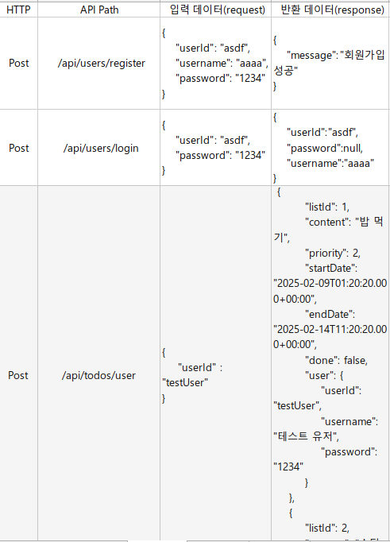
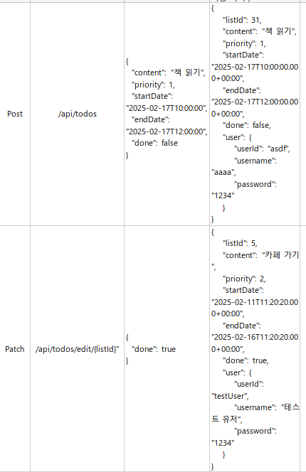
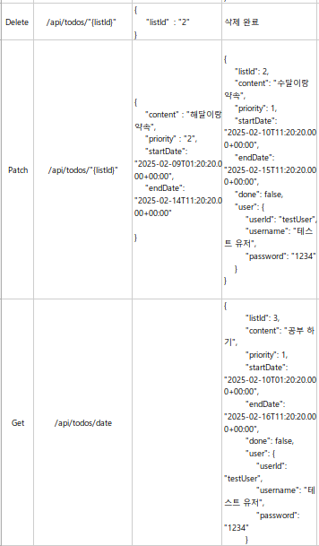
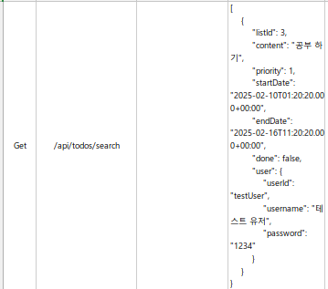

# TodoList

날짜별 할 일을 관리하는 TodoList 프로젝트입니다.

| 화면 1 | 화면 2 | 화면 3 |
|-------|-------|-------|
|  |  |  |

## 브랜치 안내
- `front`: 프론트엔드
- `master`: 백엔드

## 브랜치별 구조

### Front (`origin/front`)
```text
.
├─ src/
│  ├─ components/      # Header, Editor, List, TodoItem, Modal 등 UI 컴포넌트
│  ├─ pages/           # Login, Register, Home, NotFound
│  ├─ contexts/        # TodoContext
│  ├─ routes/          # AppRouter
│  ├─ config.js        # API base, mock mode 설정
│  └─ main.jsx         # 앱 진입점
├─ index.html
├─ package.json
└─ vite.config.js
```

#### Front 상세
- 라우팅
  - `src/routes/AppRouter.jsx`: `/`(로그인), `/register`, `/home`, `*`(NotFound) 라우트 정의
- 페이지 레이어
  - `src/pages/Login.jsx`: 로그인 요청, 세션 확인 전환
  - `src/pages/Register.jsx`: 회원가입 요청
  - `src/pages/Home.jsx`: Todo 상태 관리(useReducer), 날짜 이동, CRUD orchestration
  - `src/pages/NotFound.jsx`: 잘못된 경로 처리
- 상태 관리
  - `src/contexts/TodoContext.jsx`: Todo state/dispatch 컨텍스트 제공
  - `src/pages/Home.jsx`: `CREATE/UPDATE/EDIT/DELETE/SET_TODOS` 리듀서
- 컴포넌트 레이어
  - `src/components/Header.jsx`: 날짜 이동, 로그아웃
  - `src/components/Editor.jsx`: Todo 생성 입력
  - `src/components/List.jsx`: 목록 렌더링 + 검색(`/api/todos/search`)
  - `src/components/TodoItem.jsx`: 단건 체크/수정/삭제
  - `src/components/DeleteModal.jsx`, `src/components/GetDataModal.jsx`: 모달 UI
- 환경 설정
  - `src/config.js`: `BASE_URL`, `MOCK_MODE`, `MOCK_USER` 관리
  - `.env`: `VITE_API_BASE_URL`, `VITE_MOCK_MODE` 주입
- 빌드/실행
  - `package.json`: `npm run dev`, `npm run build`, `npm run preview`

### Back (`origin/master`)
```text
.
├─ src/main/java/com/example/ToDoList/
│  ├─ user/            # UserController, UserService, DTO/Request, Repository
│  ├─ List/            # TodoController, TodoService, Entity/Request, Repository
│  ├─ config/          # WebConfig
│  ├─ exception/       # GlobalExceptionHandler, 커스텀 예외
│  └─ ToDoListApplication.java
├─ src/main/resources/
│  ├─ application.yml
│  └─ db/migration/    # Flyway SQL
├─ build.gradle
└─ settings.gradle
```

#### Back 상세
- API 계층
  - `src/main/java/com/example/ToDoList/user/UserController.java`
    - `/api/users/register`, `/api/users/login`, `/api/users/logout`, `/api/users/session`
  - `src/main/java/com/example/ToDoList/List/TodoController.java`
    - `/api/todos` CRUD, `/api/todos/date`, `/api/todos/search`
- 서비스 계층
  - `src/main/java/com/example/ToDoList/user/UserService.java`: 회원가입/인증/조회 로직
  - `src/main/java/com/example/ToDoList/List/TodoService.java`: Todo 생성/수정/삭제/검색/날짜 조회 로직
- 영속성 계층
  - `src/main/java/com/example/ToDoList/user/UserRepository.java`
  - `src/main/java/com/example/ToDoList/List/TodoRepository.java`
  - JPA 기반으로 DB 접근
- 도메인/DTO
  - `src/main/java/com/example/ToDoList/user/User.java`, `UserDTO.java`, `LoginRequest.java`, `RegisterRequest.java`
  - `src/main/java/com/example/ToDoList/List/Todo.java`, `TodoUpsertRequest.java`, `TodoCheckUpdateRequest.java`
- 예외/설정
  - `src/main/java/com/example/ToDoList/exception/GlobalExceptionHandler.java`: 예외 응답 통합 처리
  - `src/main/java/com/example/ToDoList/config/WebConfig.java`: CORS/웹 설정
  - 세션 키 `userId`로 인증 상태 유지 (쿠키 세션)
- DB 마이그레이션
  - `src/main/resources/db/migration/V1__create_tables.sql`
  - `src/main/resources/db/migration/V2__seed_data.sql`
  - Flyway 자동 마이그레이션
- 실행 설정
  - `src/main/resources/application.yml`: MySQL datasource, JPA, Flyway, session 설정
  - `.env`: `DB_PASSWORD` 등 민감정보 주입

## 주요 기능
- 회원가입 / 로그인 / 로그아웃
- 할 일 생성 / 수정 / 삭제 / 완료 체크
- 날짜별 할 일 조회
- 검색 기능 (할 일 제목 기준)

## Mock 로그인 안내
- `VITE_MOCK_MODE=true`일 때 Mock 모드로 동작합니다.
- Mock 모드에서는 **고정 아이디/비밀번호가 없습니다.**
- 아이디/비밀번호에 빈 값만 아니면 로그인됩니다.

## API
- `POST /api/users/login`
- `GET /api/users/session`
- `POST /api/users/logout`
- `POST /api/users/register`
- `GET /api/todos/date?date={date}`
- `GET /api/todos/search?keyword={keyword}`
- `POST /api/todos`
- `PATCH /api/todos/{listId}`
- `PATCH /api/todos/edit/{listId}`
- `DELETE /api/todos/{listId}`

## API 스크린샷





## 주요 페이지/컴포넌트
- `Home`: 할 일 목록 메인 페이지
- `Login`: 로그인 페이지
- `Register`: 회원가입 페이지
- `NotFound`: 404 페이지

## DB 스키마
```sql
CREATE TABLE users (
    user_id VARCHAR(50) PRIMARY KEY,
    username VARCHAR(100) NOT NULL,
    password VARCHAR(255) NOT NULL
);
```

```sql
CREATE TABLE list_tb (
    list_id BIGINT AUTO_INCREMENT PRIMARY KEY,
    content VARCHAR(255) NOT NULL,
    priority INT NOT NULL,
    start_date DATETIME NOT NULL,
    end_date DATETIME NOT NULL,
    done BOOLEAN NOT NULL DEFAULT FALSE,
    user_id VARCHAR(50),
    FOREIGN KEY (user_id) REFERENCES users(user_id) ON DELETE CASCADE
);
```

- `users` : `list_tb` = 1:N
- 사용자 삭제 시 해당 사용자의 할 일은 `CASCADE DELETE` 됩니다.
